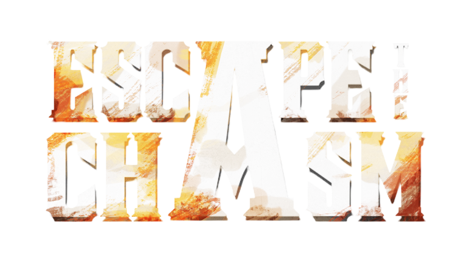

# Escape the Chasm

## Game Concept

Escape the Chasm is a hyper-casual arcade survival web game where the player has to escape in a futuristic facility using their escape elevator while facing enemy hordes. They must survive as long as they can using their guns to defeat the enemies. Targeting specifically towards arcade enthusiasts and web3 gamers that to incentivize their skills and achievements. 

By focusing on skill and innovation, we aim to revolutionize the gaming landscape. Our goal is to inspire excellence and redefine success through innovative, achievement-driven gameplay that elevates the player's journey.

## Roadmap

### Phase 1: Pre-Launch & Soft Launch

- Game prototype with core mechanics
- Wallet connection functionality
- Character and environment assets
- Smart contract development

### Phase 2: Launch

- Power-ups and boosters with crypto integration
- Weapon upgrade system
- Leaderboards and social features
- New level releases

### Phase 3: Expansion

- More exclusive level access
- NFT marketplace integration
- Community guilds (Co-op gameplay)
- Collaborative guild objectives

#### Phase 4: Sustained Growth

- Limited-time NFT event challenges
- Economic stability monitoring
- Guild tournaments and marketplace expansion
- Multi-Device Support 


## Infrastructure

This is a Phaser 3 game that uses the React framework and Vite for bundling. It includes a bridge for React to Phaser game communication, hot-reloading for quick development workflow and scripts to generate production-ready builds. Matter.JS is used as a main 2D physics engine for emulating 2D rigid bodies of the game sprites. 

### Versions

- [Phaser 3.88.0](https://github.com/phaserjs/phaser)
- [React 18.2.0](https://github.com/facebook/react)
- [Vite 5.3.1](https://github.com/vitejs/vite)
- [TypeScript 5.2.2](https://github.com/microsoft/TypeScript)

## Requirements

[Node.js](https://nodejs.org) is required to install dependencies and run scripts via `npm`.

## Available Commands

| Command | Description |
|---------|-------------|
| `npm install` | Install project dependencies |
| `npm run dev` | Launch a development web server |
| `npm run build` | Create a production build in the `dist` folder |
| `npm run dev-nolog` | Launch a development web server without sending anonymous data (see "About log.js" below) |
| `npm run build-nolog` | Create a production build in the `dist` folder without sending anonymous data (see "About log.js" below) |

## Writing Code

After cloning the repo, run `npm install` from your project directory. Then, you can start the local development server by running `npm run dev`.

The local development server runs on `http://localhost:8080` by default. Please see the Vite documentation if you wish to change this, or add SSL support.

Once the server is running you can edit any of the files in the `src` folder. Vite will automatically recompile your code and then reload the browser.

## Project Structure

Provided is a game project folder structure. This is as follows:

- `index.html` - A basic HTML page to contain the game.
- `src` - Contains the React client source code.
- `src/main.tsx` - The main **React** entry point. This bootstraps the React application.
- `src/vite-env.d.ts` - Global TypeScript declarations, provide types information.
- `src/App.tsx` - The main React component.
- `public/style.css` - Some simple CSS rules to help with page layout.
- `public/assets` - Contains the static assets used by the game.
- `src/game/PhaserGame.tsx` - The React component that initializes the Phaser Game and serve like a bridge between React and Phaser.
- `src/game/EventBus.ts` - A simple event bus to communicate between React and Phaser.
- `src/game` - Contains the game source code.
- `src/game/main.tsx` - The main **game** entry point. This contains the game configuration and start the game.
- `src/game/scenes/` - The Phaser Scenes are in this folder.
- `src/game/config` - The configuration files for default values of the entities and systems.
- `src/game/entities/` - Contains all of the game entities and its components.
- `src/game/levels/` - Contains all gameplay systems for a specific level.
- `src/game/logic/` - Contains the global game systems that interact the most on the entities and its components.
- `src/game/scenes/` - A set of scenes use for UI programming and rendering of the game.
- `src/game/UIComponents/` - List of all UI components, e.g. buttons, that interact with the player to the game systems.

## React Bridge

The `PhaserGame.tsx` component is the bridge between React and Phaser. It initializes the Phaser game and passes events between the two.

To communicate between React and Phaser, you can use the **EventBus.js** file. This is a simple event bus that allows you to emit and listen for events from both React and Phaser.

```js
// In React
import { EventBus } from './EventBus';

// Emit an event
EventBus.emit('event-name', data);

// In Phaser
// Listen for an event
EventBus.on('event-name', (data) => {
    // Do something with the data
});
```

In addition to this, the `PhaserGame` component exposes the Phaser game instance along with the most recently active Phaser Scene using React forwardRef.

Once exposed, you can access them like any regular react reference.

## Attributions

- Joel Steudler | Modern Day Massive - Pyscho Analysis
- Floraphonic | Metal Hit 95
- Yael Gomez | Gunshot Sound - Heavy FX

## We are Escapicism!

We are looking for developers and artists who share the same vision with us to revolutionize this Web3 game industry. So please join our community. 😄

The Escape the Chasm art and graphics assets and scripts are &copy; 2025 Escapicism.

All rights reserved.
